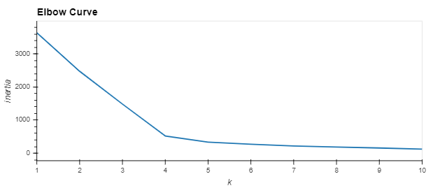
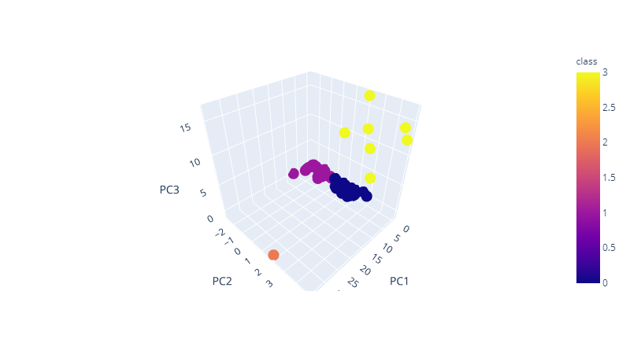
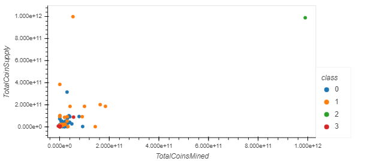

# Cryptocurrencies

We looked into all the available crypto currency in our DF

Cleaned up the Df by removing NaN values and other cryptos which didnt have weighted input to our DF

We used the K-means to determine the number of clusters = 4

We visualized the results using a 3d plot chart and a scatter plot

